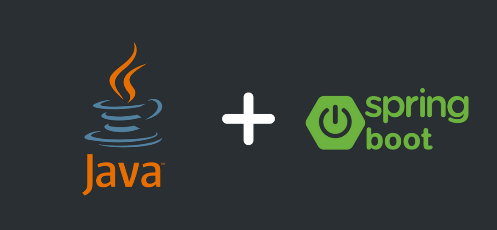

# Learning Spring Boot

Welcome to my Spring Boot learning repository! Here, I document my journey of learning Spring Boot with a simple example.

## About Spring Boot

Spring Boot makes it easy to create stand-alone, production-grade Spring-based Applications that you can "just run". It simplifies the process of building and deploying Spring applications by providing a set of pre-configured defaults and auto-configuration of Spring and third-party libraries.

Spring Boot offers the following key features:
- **Standalone**: Spring Boot applications can be run as standalone executables with an embedded web server (like Tomcat, Jetty, or Undertow), eliminating the need for traditional application servers.
- **Auto-configuration**: Spring Boot automatically configures your application based on the dependencies you have added to the project, reducing the need for manual configuration.
- **Starter dependencies**: Spring Boot provides a set of "starter" dependencies that encapsulate sets of common libraries, simplifying dependency management and reducing the amount of boilerplate code you need to write.
- **Production-ready**: Spring Boot includes features like health checks, metrics, and externalized configuration to help you build production-ready applications out of the box.

## Example Project

In this repository, I am working on a simple Spring Boot example project. Each commit represents a step in my learning process, covering various aspects of Spring Boot development.

You can follow along with my progress by checking out the commits and exploring the code changes and explanations provided in each commit message.

Feel free to reach out if you have any questions or suggestions!

Happy learning! 🚀
